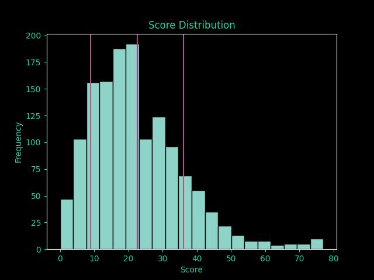
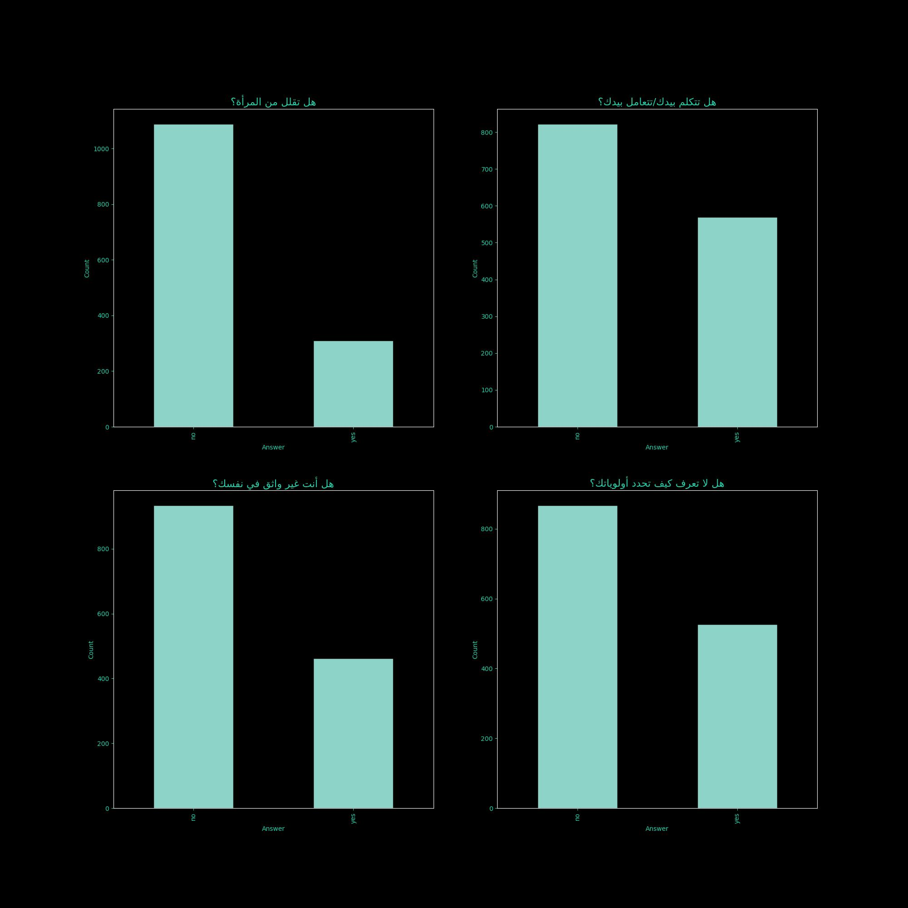
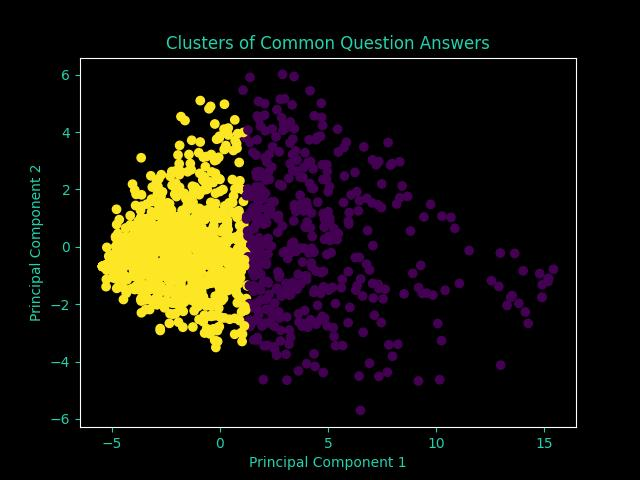

# MiraScale

## Background

It's better to view the original tweet here: https://twitter.com/TokieWho/status/1746313778377994259

**TL;DR**: A girl posted a long list (77 questions) of things that make men suck. So I made a form as a quiz to see how much you would suck according to her _list_

## Introduction

After collecting the data I removed the submissions that solved less than 70% of the questions leading to 1400 items after filtration (from 1520 raw).

I used mainly matplotlib for graphing with. All data here is free to use. 

## Stats For Nerds

### Score Distribution

We can see that the main data had this statistics:
- Total number of submissions after filtering: 1400 People
- Mira would marry with 90% threshold: 150 People
- Mira htt2fl mnhom with 90% threshold: 1250
- Mean Score: 22.53857142857143
- Standard Deviation: 13.59571257375031

### Single Questions

I made a tool to choose some random 4 questions and show their percentages. You can modify it so you get graphs for some specific questions but I'm too lazy to check which questions are actually useful.

### Clustering

I had the feeling that there are some defining features between questions that split it to two "clusters" so I used KMean to cluster answers after following this simple flow for data: extract -> standardize -> PCA -> KMeans -> visualize

For instance, some defining questions for the first cluster (each with > 80% similarity) were:

- هل أنت بخيل: آه
- هل أنت غير نظيف: آه
- هل انت ضد المقاومة: لا

And for cluster 2:
- هل تصلي؟: آه
- هل تهزر هزار غير محترم؟: لا
- هل تسكت عندما تزعل؟: آه
## Conclusion

Yeah I was bored. 
